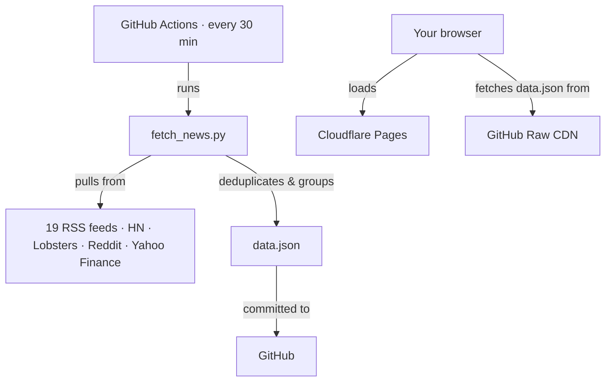

# 📰 The World State

A static, broadsheet-style news aggregator.

**[Live site →](https://news.nathankurien.com)**

---

## Why?

I've been finding it harder to find out what's going on in the world with current news sites and headlines. You end up reading one outlet's spin on a story instead of seeing the full picture.

The World State takes a different approach:

- **Consensus over bias.** Stories about the same event from BBC, Al Jazeera, France24, Straits Times, etc. are grouped into a single card. You see how widely something is being reported and can compare sources directly.
- **Signal over noise.** A print-newspaper layout. No infinite scroll, no recommended content, no engagement tricks.
- **Private by default.** Entirely static. Runs in your browser. Nothing phones home.

---

## How it works



**Backend:** A Python script fetches headlines from 19 global RSS feeds in parallel, plus Hacker News, Lobste.rs, five Reddit subs, financial tickers, and newsletter digests. It then groups duplicate stories and writes everything to a single `data.json`.

**Frontend:** One static HTML file. On load, client-side JS fetches `data.json` from the GitHub raw CDN (with a cache-buster), so Cloudflare Pages never needs to rebuild. Supports a dark "Night Edition" and escapes all rendered content against XSS.

### Story grouping

The deduplication pipeline is pure Python with no ML. Just text similarity:

1. **Trigrams.** Headlines are normalised (lowercase, strip possessives/punctuation/stopwords) and compared via 3-word sliding windows. A story needs ≥2 matching trigrams to be grouped. Merged stories register their trigrams back to the canonical parent, so transitive chains (A≈B, B≈C → all grouped under A) work correctly.

2. **Jaccard fallback.** Catches reworded headlines where the vocabulary is near-identical but word order differs. Threshold: ≥0.7.

3. **Overlap coefficient fallback.** Catches cases where one outlet writes a long headline and another writes a short one (big union tanks Jaccard). Threshold: ≥0.6 with ≥4 shared words to prevent false positives on short unrelated headlines.

Grouped stories get a consensus score (= number of unique reporting outlets) and float to the top.

---

## Features

- **Breaking news panel.** High-consensus stories from the last 3 hours. Stays quiet when nothing major is happening.
- **Collapsible alternative sources.** Every grouped story has a dropdown listing all other outlets' versions with links and timestamps.
- **Markets section.** Delayed-quote financial ticker (indices, commodities, forex, equities) styled like a newspaper finance page.
- **Briefings & Digests.** Curated feeds from Politico Playbook, The Economist, Stratechery, and others.
- **Source caps.** No single outlet can dominate the layout (max 2 breaking, 6 world per source).

---

## Local development

```bash
git clone git@github.com:nkurien/world-state-news.git
cd world-state-news

python -m venv .venv && source .venv/bin/activate
pip install -r requirements.txt

# Compile a fresh data.json
python fetch_news.py

# Run tests
python -m pytest test_fetch_news.py -v

# View the site
python -m http.server 8000
# → open http://localhost:8000
```

---

## License

Open source. Free to use.
